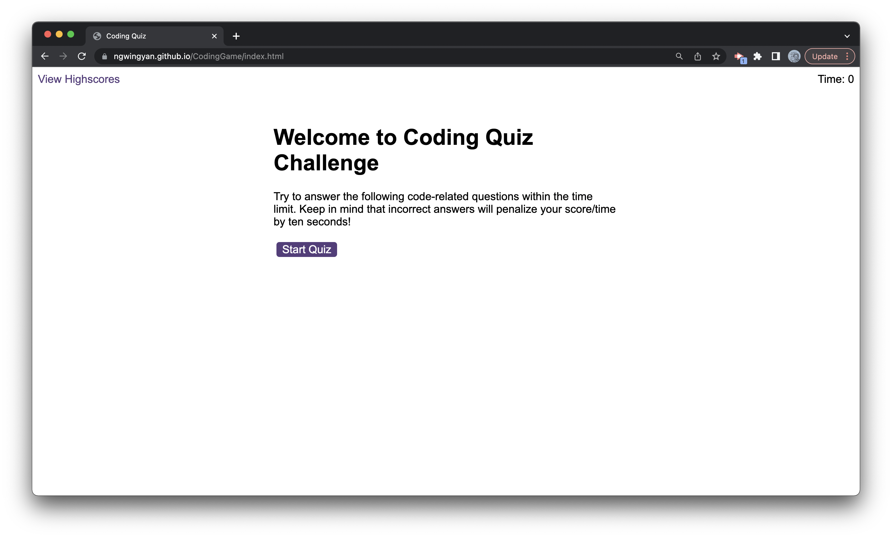
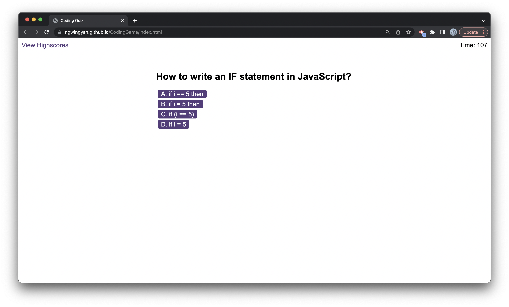
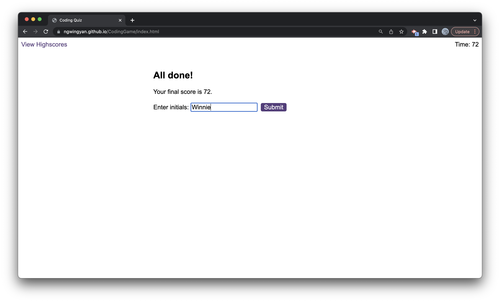
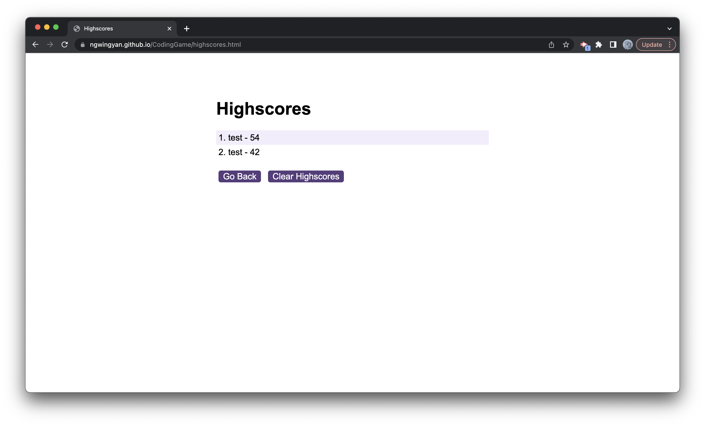

# CodingGame

## Purpose
To test Javascript knowledge with a timed quiz of 8 questions and compare the scores with other users

## Features and Screenshot
- Structure of the quiz: 8 questions in total; 15 seconds allowed for each question with 10 seconds deducted when the answer is wrong.

- no. of questions, no. of options, time allowed or deducted for each question adjustable

- Press the start button

- Each question has four choices, with timer countdown at the top right hand corner

- End screen - submit initials

- High score screen - display scores for each user in descending order

## Technology used
- Javascript (for loop, if else, setInterval, clearInterval), HTML, CSS

## License
Please refer to the license in the repository.

## Link
- Repository URL - https://github.com/ngwingyan/CodingGame
- Deployed URL - https://ngwingyan.github.io/CodingGame/